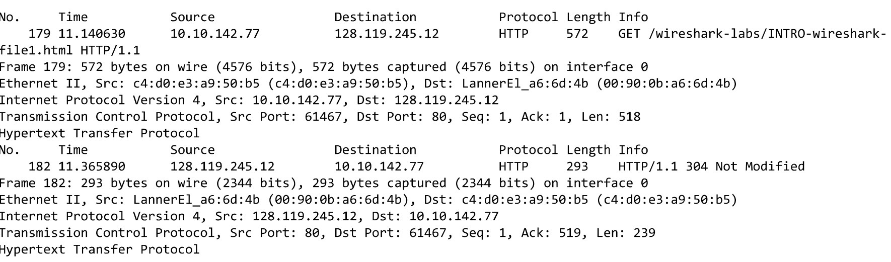

### 问题
1. 列出上述步骤7中出现在未过滤的分组列表窗口的协议列中的3种不同的协议。
2. 从HTTP GET消息发送到HTTP OK回复需要多长时间?(默认情况下,分组列表窗口中的时间列的值是自Wireshark开始捕获以来的时间(以秒为单位)。要想以日期格式显示时间,请选择Wireshark的“视图”下拉菜单,然后选择“时间显示格式”，然后选择“日期和时间”。)
3. gaia.cs.umass.edu(也称为wwwnet.cs.umass.edu)的Internet地址是什么?您的计算机的Internet地址是什么?
4. 打印问题2提到的两个HTTP消息(GET和OK)。要这样做,从Wireshark的“文件”菜单中选择“打印”,然后选择“仅选中分组”和“按当前显示”按钮,然后单击确定。

### 答案
1. TCP、UDP、HTTP等
2. 据Wireshark显示,1.294273秒发送请求“GET”,1.519528秒接受回应“200 OK”。需要0.225255秒。
3. 主机地址为10.10.142.77,服务器地址为128.119.245.12
4. 消息截图
