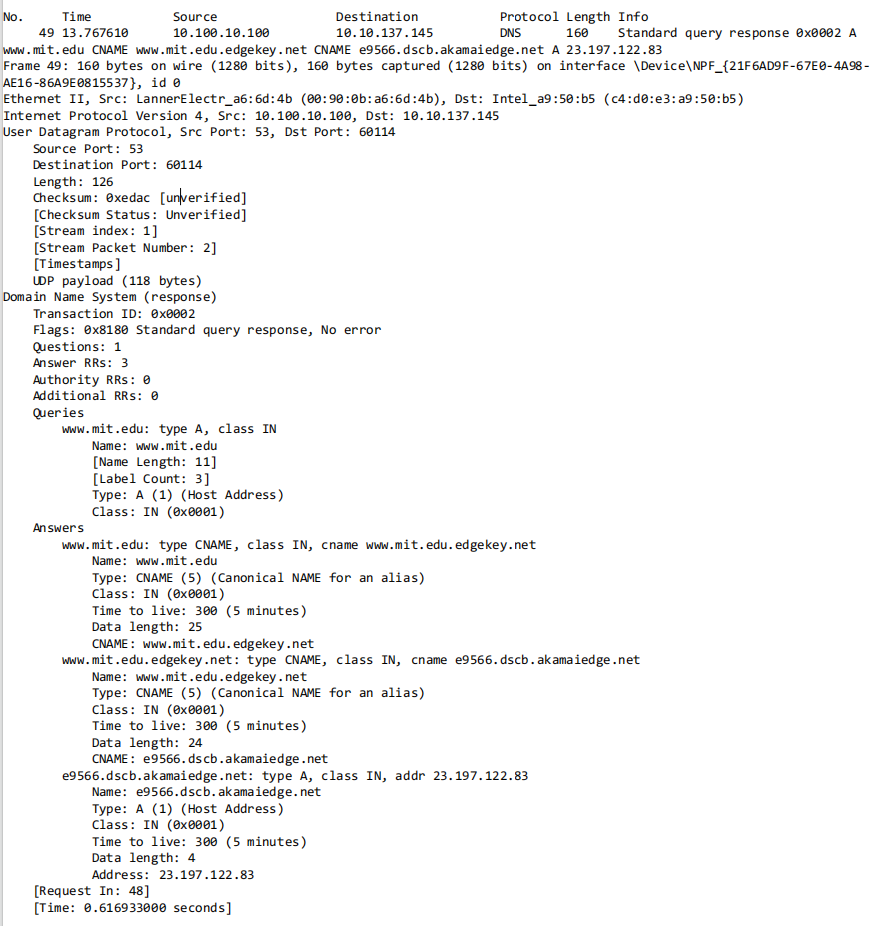

### 问题
#### nslookup
1. Run nslookup to obtain the IP address of a Web server in Asia. What is the IP address of that server?
2. Run nslookup to determine the authoritative DNS servers for a university in Europe.
3. Run nslookup so that one of the DNS servers obtained in Question 2 is queried for the mail servers for Yahoo! mail. What is its IP address?
#### Tracing DNS with Wireshark
4. Locate the DNS query and response messages. Are then sent over UDP or TCP?
5. What is the destination port for the DNS query message? What is the source port of DNS response message?
6. To what IP address is the DNS query message sent? Use ipconfig to determine the IP address of your local DNS server. Are these two IP addresses the same?
7. Examine the DNS query message. What “Type” of DNS query is it? Does the query message contain any “answers”?
8. Examine the DNS response message. How many “answers” are provided? What do each of these answers contain?
9. Consider the subsequent TCP SYN packet sent by your host. Does the destination IP address of the SYN packet correspond to any of the IP addresses provided in the DNS response message?
10. This web page contains images. Before retrieving each image, does your host issue new DNS queries?
#### Now let’s play with nslookup
11. What is the destination port for the DNS query message? What is the source port of DNS response message?
12. To what IP address is the DNS query message sent? Is this the IP address of your default local DNS server?
13. Examine the DNS query message. What “Type” of DNS query is it? Does the query message contain any “answers”?
14. Examine the DNS response message. How many “answers” are provided? What do each of these answers contain?
15. Provide a screenshot.
#### Now repeat the previous experiment, but instead issue the command: nslookup –type=NS mit.edu
16. To what IP address is the DNS query message sent? Is this the IP address of your default local DNS server?
17. Examine the DNS query message. What “Type” of DNS query is it? Does the query message contain any “answers”?
18. Examine the DNS response message. What MIT nameservers does the response message provide? Does this response message also provide the IP addresses of the MIT namesers?
19. Provide a screenshot.
#### Now repeat the previous experiment, but instead issue the command: nslookup www.aiit.or.kr bitsy.mit.edu
20. To what IP address is the DNS query message sent? Is this the IP address of your default local DNS server? If not, what does the IP address correspond to?
21. Examine the DNS query message. What “Type” of DNS query is it? Does the query message contain any “answers”?
22. Examine the DNS response message. How many “answers” are provided? What does each of these answers contain?
23. Provide a screenshot.

### 答案
1. 
2. 
3. 连续换了多个欧洲大学的DNS服务器都无法使用他们的DNS服务器进行查询,推测大学DNS服务器只接收来自特定区域的DNS查询
4. 使用的是UDP协议
5. 目标端口是53,源端口为53302
6. DNS查询消息被发送到10.100.10.100,这个IP地址与本地的DNS服务器IP地址相同
7. DNS查询消息的Type=A,代表本次DNS是"通常"的查询,寻找目标域名的IP地址,查询消息不包含answers
8. DNS响应消息里的answers包含了两段信息,分别表示了www.ietf.org这个URL的两个IP地址,其中每个都有Name,Type,Class,Time,Data,Address字段。会有两个IP地址代表www.ietf.org使用了负载均衡
9. 不一样,由于使用了VPN导致请求都转发给了代理服务器,但从内容能判断紧接着DNS查询请求结束之后的TCP握手是与www.ietf.org进行的
10. 还发送了两个新的DNS查询,推测Web网页上的图片资源分散在另外两台服务器上

11. DNS查询的目标端口依然是53,源端口为60114
12. 查询消息目标IP地址依然为10.100.10.100,这是我的本地DNS服务器
13. DNS查询的Type字段为A,不包含answers
14. DNS响应消息的一个Answers有三个字段,这些字段包含Name,Type,Class,Time,Data,CNAME等消息。
15. 
16. DNS查询发送的IP地址有两个,一个是10.100.10.100,一个是114.114.114.114。第一个DNS查询在超时后使用了备用DNS服务器地址进行查询
17. Type字段中是NS,不包含answers
18. 提供了很多歌MIT域名服务器,还提供了域名服务器的IP地址
19. 
20. DNS查询消息发送到的IP地址均为18.0.72.3,这并不是本地DNS服务器的地址,而是bitsy.mit.edu的地址。但我的查询并没有成功,原因应该和上文一样,大学DNS服务器限制了区域请求
21. 查询消息中的Type字段为A,没有answers
22. 不使用bitsy.mit.edu直接进行查询,只有一个Answers,有Name,Type,Class,Time,Data,Address字段
23. 