### 问题
#### 基本HTTP GET/response交互
1. 您的浏览器是否运行HTTP版本1.0或1.1？服务器运行什么版本的HTTP？
2. 您的浏览器会从接服务器接受哪种语言（如果有的话）？
3. 您的计算机的IP地址是什么？ gaia.cs.umass.edu服务器地址呢？
4. 服务器返回到浏览器的状态代码是什么？
5. 服务器上HTML文件的最近一次修改是什么时候？
6. 服务器返回多少字节的内容到您的浏览器？
7. 通过检查数据包内容窗口中的原始数据，你是否看到有协议头在数据包列表窗口中未显示？如果是，请举一个例子。
#### HTTP条件Get/response交互
8. 检查第一个从您浏览器到服务器的HTTP GET请求的内容。您在HTTP GET中看到了“IF-MODIFIED-SINCE”行吗？
9. 检查服务器响应的内容。服务器是否显式返回文件的内容？ 你是怎么知道的？
10. 现在，检查第二个HTTP GET请求的内容。您在HTTP GET中看到了“IF-MODIFIED-SINCE:”行吗？ 如果是,“IF-MODIFIED-SINCE:”头后面包含哪些信息？
11. 针对第二个HTTP GET，从服务器响应的HTTP状态码和短语是什么？服务器是否明确地返回文件的内容？请解释。
#### 检索长文件
12. 您的浏览器发送多少HTTP GET请求消息？哪个数据包包含了美国权利法案的消息？
13. 哪个数据包包含响应HTTP GET请求的状态码和短语？
14. 响应中的状态码和短语是什么？
15. 需要多少包含数据的TCP段来执行单个HTTP响应和权利法案文本？
#### 具有嵌入对象的HTML文档
16. 您的浏览器发送了几个HTTP GET请求消息？ 这些GET请求发送到哪个IP地址？
17. 浏览器从两个网站串行还是并行下载了两张图片？请说明。
#### HTTP认证
18. 对于您的浏览器的初始HTTP GET消息，服务器响应（状态码和短语）是什么响应？
19. 当您的浏览器第二次发送HTTP GET消息时，HTTP GET消息中包含哪些新字段？

### 答案
1. 我的浏览器运行HTTP版本1.1,服务器也运行HTTP版本1.1
2. 我的浏览器接受zh-CN,en-GB,en-US等语言
3. 我的计算机的IP地址是10.10.136.26,而服务器的IP地址是128.119.245.12
4. 服务器返回的状态代码是200,代表成功返回资源
5. 服务器的最近一次修改是2024年12月18日晚上06点59分01秒,星期三
6. 返回了128字节
7. 数据包列表字段在初始化设置的情况下只显示HTTP方法行与请求文件类型,例如date字段便没有显示
8. 没有,第1个HTTP请求中没有“IF-MODIFIED-SINCE”行
9. 是显式返回,因为存在数据段,同时带有Content-Length头部字段
10. 发现相应字段,IF-MODIFIED-SINCE字段后附带的是html资源的最后修改时间
11. 状态码为304,短语为Not Modified,没有明确返回文件的内容,报文没有数据段,同时也没有Content-Length头部字段
12. 1个,HTTP请求送出后进行了三次握手,在三次握手结束后接收了3个TCP包与1个HTTP响应包,这些包中包含了美国权利法案的消息
13. 第8个包中包含了状态码和短语
14. 响应的状态码是200,短语是OK
15. 需要3个TCP包传送所有美国权利法案文本
16. 我的浏览器发送了3个HTTP请求,这些请求被发送到地址128.119.245.12上
17. 我的浏览器是并行下载了两张图片,可从请求与响应的时间判断,两个请求信息都在图片文件响应信息之前发送的
18. 对于初次HTTP请求,服务器返回了状态码401,状态短语Unauthorized,代表所需访问的资源需要身份验证
19. 第二次发送HTTP请求时,头部字段中添加了Authorization字段,后面跟有用来授权验证的base64编码

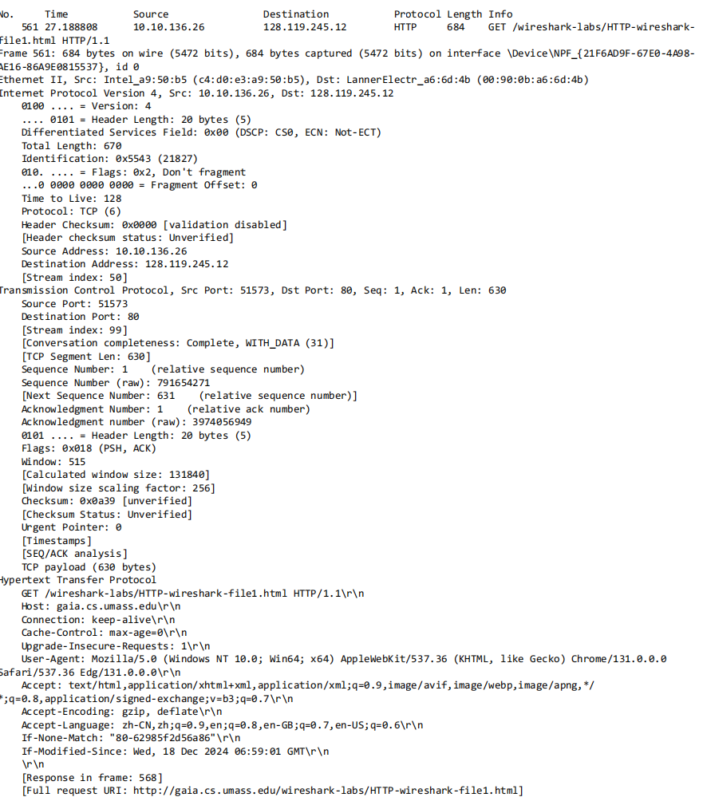
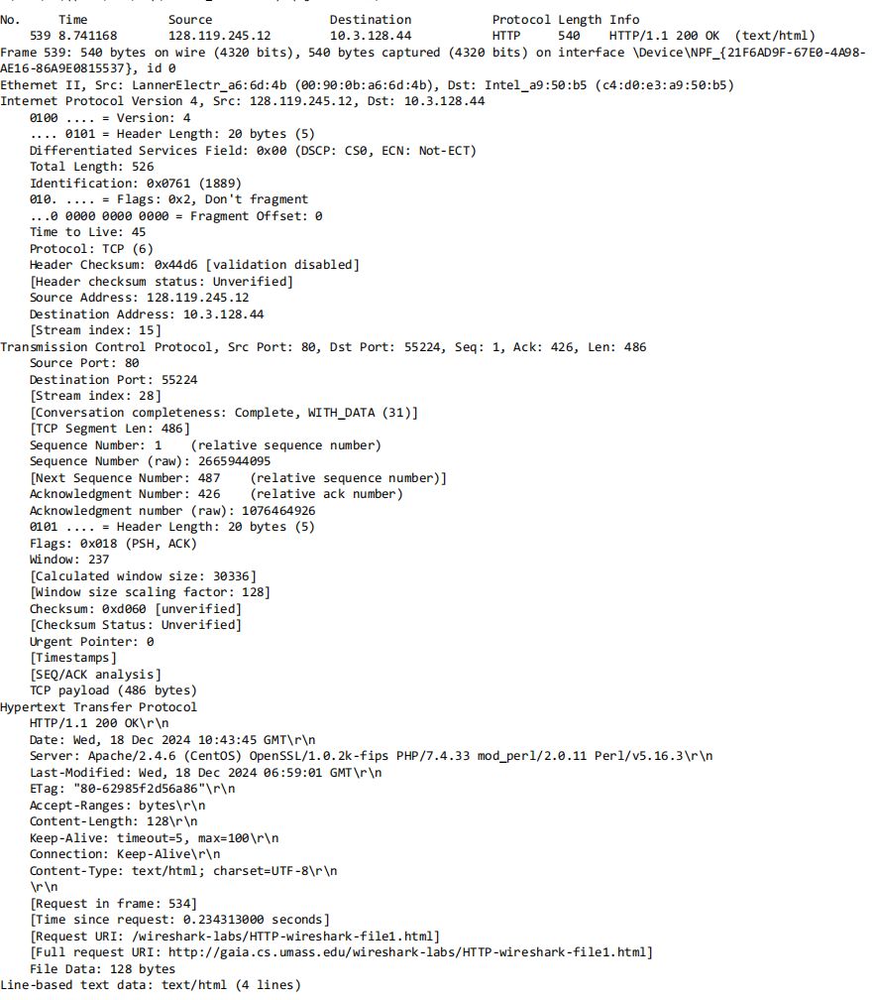
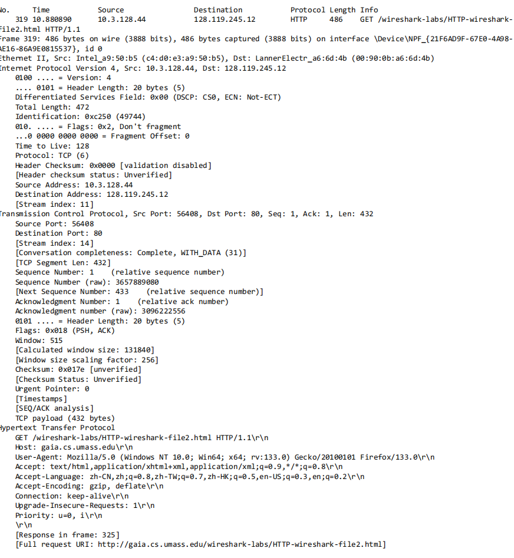
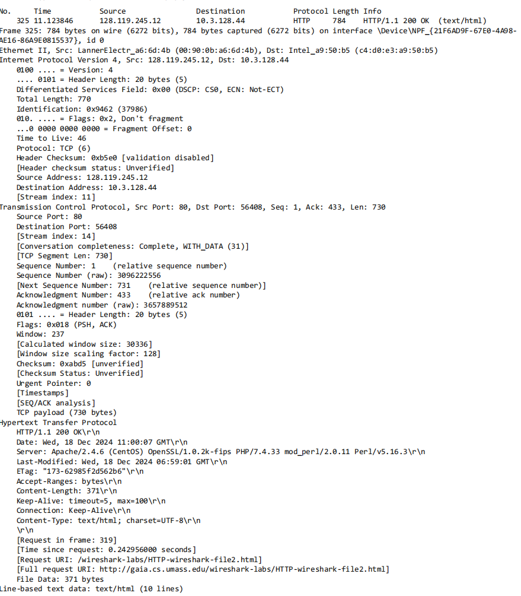
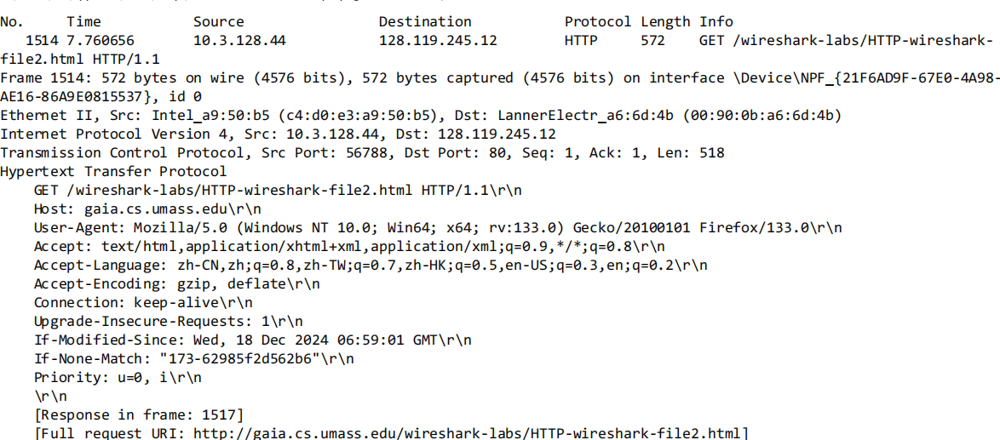
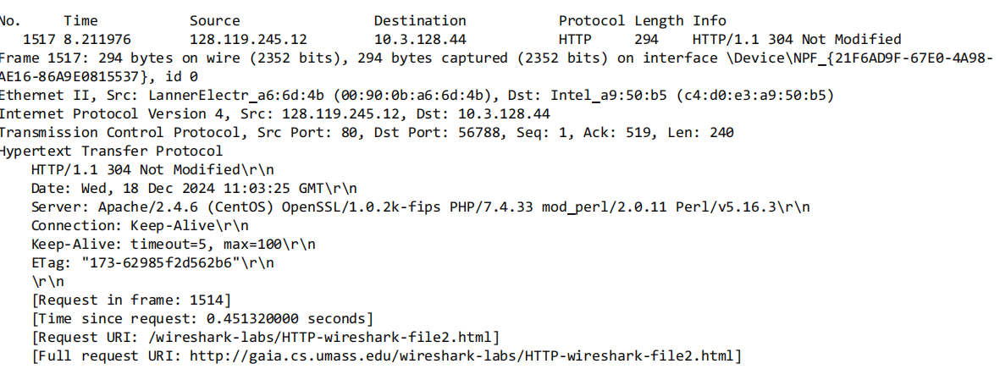
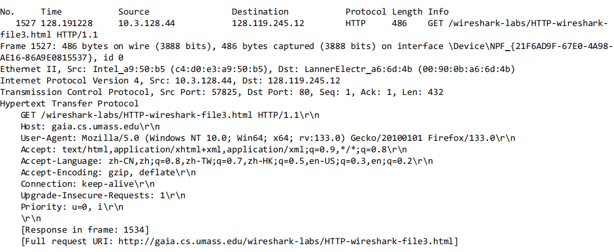
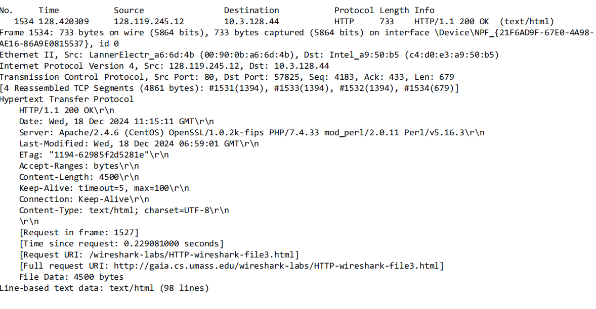
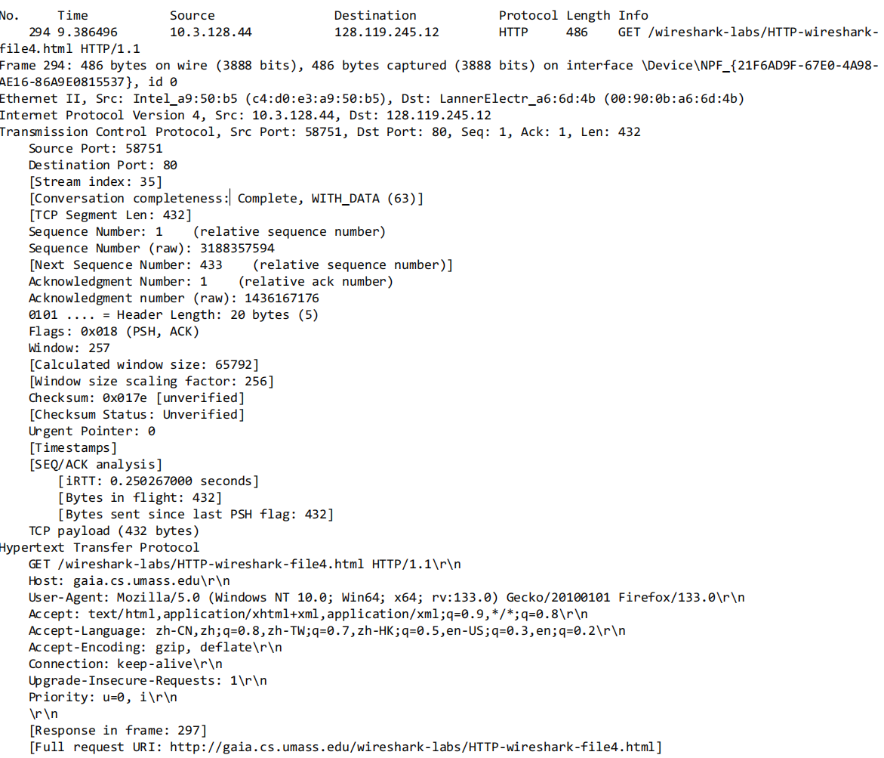
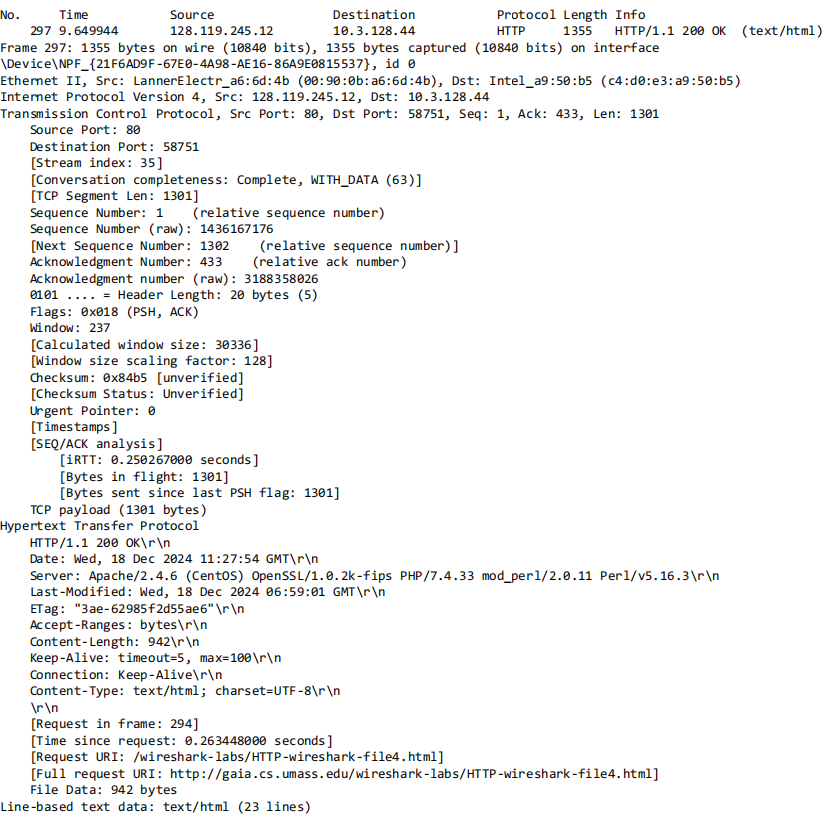
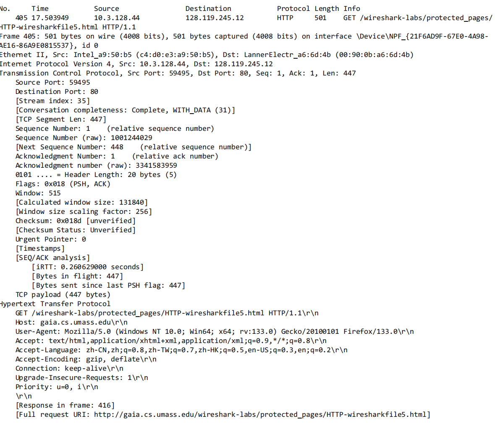
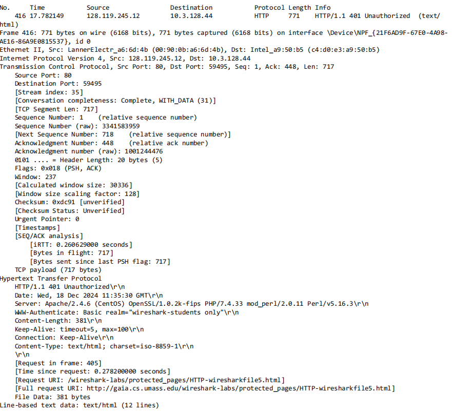
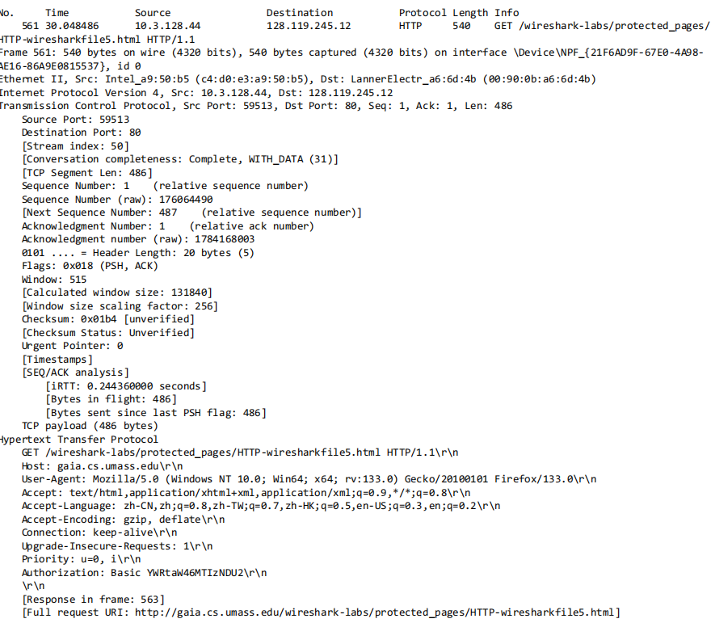
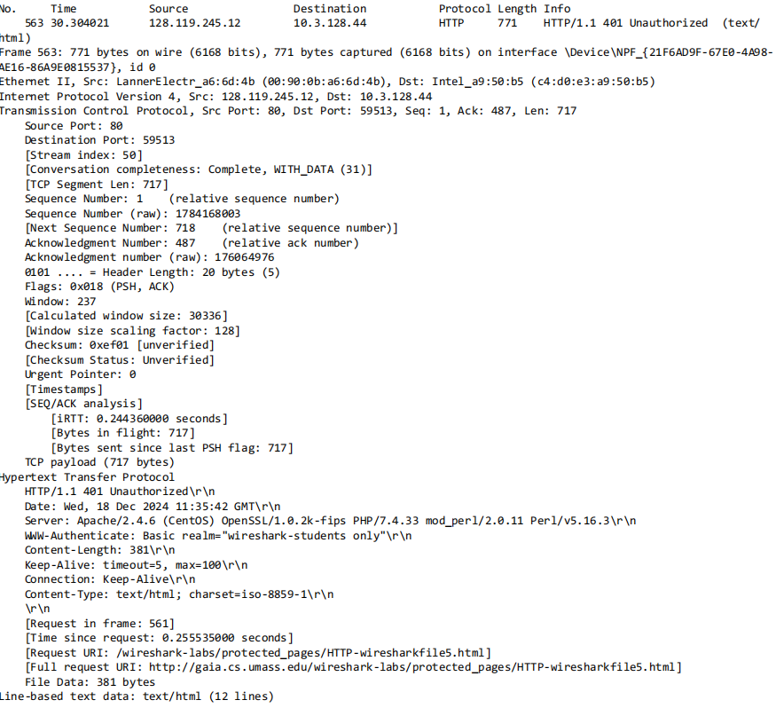