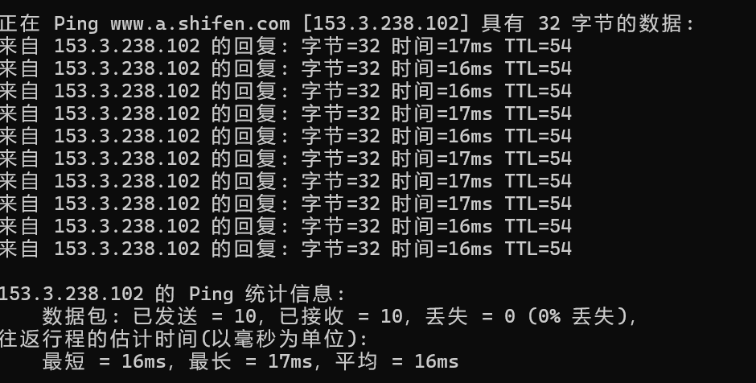
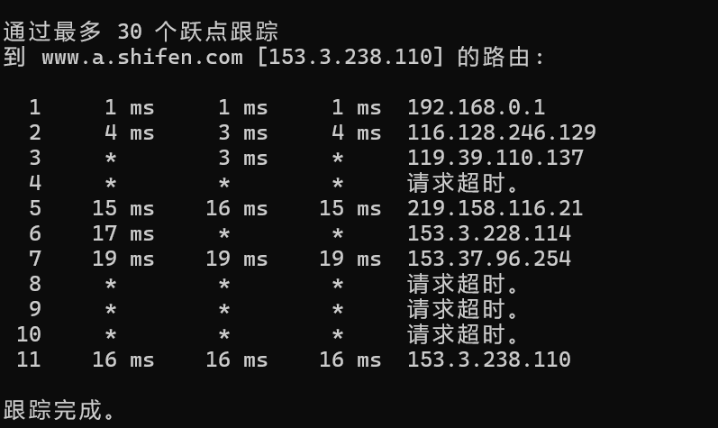

### 问题
#### ICMP and Ping
1. What is the IP address of your host? What is the IP address of the destination host?
2. Why is it that an ICMP packet does not have source and destination port numbers?
3. Examine one of the ping request packets sent by your host. What are the ICMP type and code numbers? What other fields does this ICMP packet have? How many bytes are the checksum, sequence number and identifier fields?
4. Examine the corresponding ping reply packet. What are the ICMP type and code numbers? What other fields does this ICMP packet have? How many bytes are the checksum, sequence number and identifier fields?
#### ICMP and Traceroute
5. What is the IP address of your host? What is the IP address of the target destination host?
6. If ICMP sent UDP packets instead (as in Unix/Linux), would the IP protocolnumber still be 01 for the probe packets? If not, what would it be?
7. Examine the ICMP echo packet in your screenshot. Is this different from the ICMP ping query packets in the first half of this lab? If yes, how so?
8. Examine the ICMP error packet in your screenshot. It has more fields than the ICMP echo packet. What is included in those fields?
9. Examine the last three ICMP packets received by the source host. How are these packets different from the ICMP error packets? Why are they different?
10. Within the tracert measurements, is there a link whose delay is significantly longer than others? Refer to the screenshot in Figure 4, is there a link whose delay is significantly longer than others? On the basis of the router names, can you guess the location of the two routers on the end of this link?
#### Extra Credit

### 答案

1. 我的IP地址是10.10.139.77,目的IP地址是153.3.238.102。
2. 因为ICMP工作在网络层而不是在运输层,并不依赖于特定的端口号。
3. 协议号为1,类型为8(ping),序列号、校验和、标识符都为2字节。
4. 协议号为1,类型为0,序列号、校验和、标识符都为2字节,比ping包多了time字段。

5. 我的IP地址是10.10.139.77,目的IP地址是153.3.238.102。
6. 17。
7. 有区别,多了group与severity level字段
8. 用IPv4包负载着原回显包,表示错误信息。
9. 变成了正常的ping包
10. -